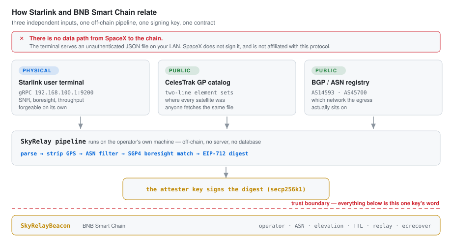
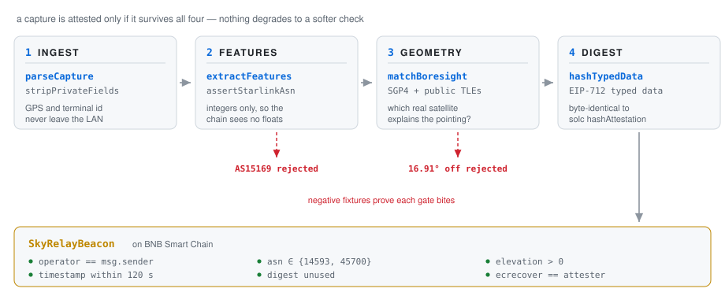
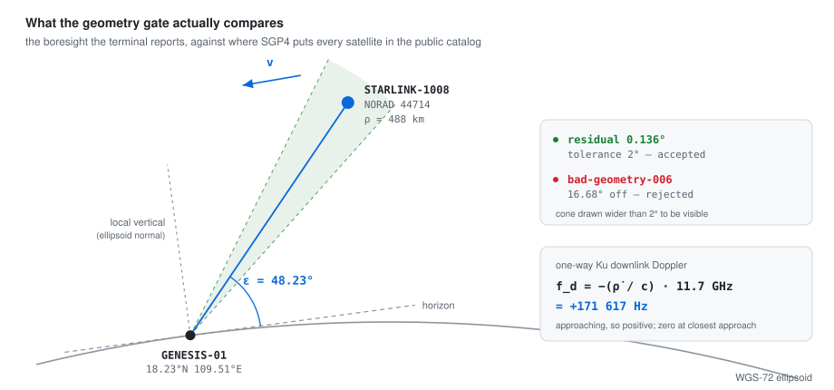

# SkyRelay

**Starlink user-terminal telemetry → physical features → EIP-712 → BNB Smart Chain.**

[skyrelay.link](https://skyrelay.link) · [github.com/SkyRelay/protocol](https://github.com/SkyRelay/protocol)

An open-source **feasibility proof**: in-repo SGP4 (WGS-72), Ku-band Doppler, AS14593/AS45700 filtering, Ethereum Keccak-256, and a Solidity verifier. No dish required. No Postgres, no Docker, no cloud.

[](https://github.com/SkyRelay/protocol/actions/workflows/ci.yml)
[](LICENSE)
[](https://www.bnbchain.org)
[](https://github.com/SpaceExplorationTechnologies/enterprise-api)

---

## Contents

- [How Starlink and BNB Smart Chain relate](#how-starlink-and-bnb-smart-chain-relate)
- [Quickstart](#quickstart)
- [What that one command prints](#what-that-one-command-prints)
- [What is verified, and against what](#what-is-verified-and-against-what)
- [The geometry gate](#the-geometry-gate)
- [Committing to the catalog](#committing-to-the-catalog)
- [The attestation](#the-attestation)
- [Quorum](#quorum)
- [Pass tracks](#pass-tracks)
- [The on-chain verifier](#the-on-chain-verifier)
- [BSC composability](#bsc-composability)
- [Bonds and equivocation](#bonds-and-equivocation)
- [Governance](#governance)
- [Running it against a real terminal](#running-it-against-a-real-terminal)
- [Physics](#physics)
- [Repository map](#repository-map)
- [Tests](#tests)
- [What this proves / does not prove](#what-this-proves--does-not-prove)
- [Known limits](#known-limits)
- [What would make this stronger](#what-would-make-this-stronger)
- [FAQ](#faq)

---

## How Starlink and BNB Smart Chain relate

<picture>
  <source media="(prefers-color-scheme: dark)" srcset="docs/img/trust-dark.svg">
  
</picture>

Read that diagram before anything else, because the interesting part is what is **missing** from it.

There is no wire between SpaceX and the chain. A Starlink terminal serves an unauthenticated JSON blob over gRPC on your own LAN; SpaceX neither signs it nor knows this protocol exists. Taken alone that blob proves nothing — anyone can type numbers into a file.

What makes a capture expensive to fabricate is the other two inputs, and neither belongs to SpaceX or to us:

- **The CelesTrak GP catalog** says where every Starlink satellite actually was. Anyone can fetch the same file and recompute the same geometry.
- **The public ASN registry** says which network an egress IP really sits on.

So a forged frame has to be simultaneously consistent with a real orbit, a real ground station, and a real instant in time. That is the whole of the physical binding, and it is genuinely non-trivial — but it is not hardware attestation, and the trust boundary in the diagram is real: everything on chain is the word of however many *bonded, registered* keys `quorumThreshold` demands. Those keys now cost `minBond` each. Two specific lies are provable on chain without computing an orbit: an attester contradicting itself about one station-second, and a sighting resolved against a catalog nobody registered. A bonded attester that never contradicts itself can still lie about the physics.

## Quickstart

Requires Node 20+ and [Foundry](https://book.getfoundry.sh/getting-started/installation).

```bash
pnpm install && pnpm verify
```

<picture>
  <source media="(prefers-color-scheme: dark)" srcset="docs/img/pipeline-dark.svg">
  
</picture>

Other entry points:

```bash
pnpm typecheck        # tsc, zero errors
pnpm test             # node:test unit suite, 58 tests
pnpm run vectors      # regenerate vectors/frames + vectors/eip712/attestations.json
cd contracts && forge test
```

`pnpm verify` is the one that matters: it runs the SGP4 lock, pushes every fixture through the pipeline and checks each negative fixture is rejected **by the gate it is supposed to trip**, then runs the unit suite, then `forge test`.

## What that one command prints

Not a claim — the actual output, reproducible on your machine with no hardware:

```
SkyRelay feasibility pipeline
=============================

  ok   SGP4 Vanguard-1 TEME residual r=6.82e-9 km  v=6.38e-10 km/s
  eip712 typehash 0x7a58c180076695c85beb4e05dff21f8bb13e5e0a32990285cc35d08f7a45cf9c
  eip712 domain   0x8b73c3c69bb8fe3d512ecc4cf759cc79239f7b179b0ffacaa9a75d522b39400f
  ok   catalog STARLINK-1008(44714) STARLINK-1526(46029) STARLINK-2034(47352)
  ok   bad-asn-005.json rejected: ASN 15169 is outside {14593, 45700}
  ok   bad-geometry-006.json rejected: boresight 259.08/47.28 deg is 16.91 deg from
       the nearest catalog satellite (NORAD 47352); tolerance is 2 deg
  ok   connected-001.json         NORAD 47352  el=47.24°  fd=173690 Hz   SNR=8.70 dB  residual 0.047°
  ok   handover-002.json          NORAD 47352  el=51.95°  fd=155110 Hz   SNR=7.40 dB  residual 0.105°
  ok   obstructed-003.json        NORAD 46029  el=15.07°  fd=-251763 Hz  SNR=3.10 dB  residual 0.251°
  ok   quorum-goonhilly-007.json  NORAD 47352  el=30.35°  fd=220040 Hz   SNR=8.10 dB  residual 0.166°
  ok   quorum-pleumeur-009.json   NORAD 47352  el=25.21°  fd=215966 Hz   SNR=6.90 dB  residual 0.193°
  ok   roam-004.json              NORAD 44714  el=45.45°  fd=188940 Hz   SNR=9.20 dB  residual 0.396°
  ok   quorum NORAD 47352 at t=1789934703: 3 stations agree, worst residual 0.193°
       connected-001          VALENTIA-01   el= 47.24°  fd=  173690 Hz  ASN 14593
       quorum-goonhilly-007   GOONHILLY-02  el= 30.35°  fd=  220040 Hz  ASN 14593
       quorum-pleumeur-009    PLEUMEUR-03   el= 25.21°  fd=  215966 Hz  ASN 45700
  ok   quorum rejects a member from another second
  ok   pass track NORAD 47352: 9 samples over 480 s, peak 75.74°, Doppler 263245 → -263449 Hz through zero
  ok   pass shape verifies from chain-visible fields alone
  ok   forged Doppler rejected: Doppler must fall through a pass

RESULT  positive=6  negative=2  quorum=3 stations  track=9 samples  forge=pass
```

Every number there is derived, not stored. The NORAD id is whichever satellite the boresight resolved to out of the whole catalog; the elevation and Doppler come out of SGP4 at the exact second the attestation commits to; the residual is how far the terminal's reported pointing sat from that satellite.

## What is verified, and against what

The point of this repository is that its claims are checkable against sources outside it. Nothing below is self-attested.

| Claim | Checked against | Residual / result |
|---|---|---|
| SGP4 position | Published verification output for satellite 00005 (Vallado et al., AIAA 2006-6753), t = 0 and 360 min | 6.8 × 10⁻⁹ km |
| SGP4 velocity | Same published output | 6.4 × 10⁻¹⁰ km/s |
| SGP4 internal consistency | Analytic velocity vs. numerical derivative of position; speed vs. vis-viva | within the model's own 2 × 10⁻⁴ relative residual |
| SGP4 transcription | satellite.js — a separate implementation of the same published algorithm — on the four shipped element sets, t = 0, 12.5, 45, 200, 720 min | 1.8 × 10⁻¹⁰ km, 1.6 × 10⁻¹³ km/s |
| GMST | Known value at J2000.0, 280.46062° | 2 × 10⁻⁶ deg |
| Station placement | WGS-72 ellipsoid equation, five latitudes | < 10⁻¹² |
| Range-rate | Numerical derivative of the reported range | < 10⁻³ km/s |
| Keccak-256 | Known Ethereum digests, plus multi-block inputs cross-checked against Foundry's Rust implementation | exact |
| EIP-712 digests | `solc` recomputes all six committed vectors from the same fields (`contracts/test/Eip712Vectors.t.sol`) | byte-identical |
| Catalog commitment | One altered digit in one element set must move `catalogHash` | exact |
| Quorum agreement | solc re-checks that the committed three-station set would satisfy `InconsistentQuorum` | pass |
| Pass shape | Monotone Doppler, one elevation maximum, one zero crossing — verified across eight real passes, three satellites, peaks 6.5°–74° | holds on all |
| Fixture reproducibility | CI regenerates `vectors/` and fails on any diff | no drift |

The velocity row exists for a reason. An earlier revision carried a stray `xke` factor on `rdotl`/`rvdotl`: position was exact to the last digit and **every Doppler number was 13.4× too small**. A position-only check cannot see that, which is why velocity is pinned against an external source and cross-checked two more ways.

## The geometry gate

<picture>
  <source media="(prefers-color-scheme: dark)" srcset="docs/img/geometry-dark.svg">
  
</picture>

`matchBoresight` asks one question: is there a satellite in the public catalog within 2° of where this terminal says it is pointing, at this exact second? It propagates every element set in the catalog, keeps only those above the horizon, takes the smallest angular separation from the reported boresight, and throws when even the best is outside tolerance.

`bad-geometry-006.json` is `connected-001` with the boresight swung 25°. It is rejected at 16.91°.

Where the 2° goes:

| Source | Magnitude |
|---|---|
| Attestation timestamps are whole seconds, so geometry is evaluated up to 1 s from the capture instant. A 550 km satellite near zenith sweeps ~0.9°/s. | ≤ ~1° |
| Terminal reporting quantisation and tracking error | ~0.1° |
| SGP4 along-track error at a half-day-old element set | ~0.1° |

The committed fixtures sit at 0.05°–0.40°, so there is roughly a 5× margin between a real capture and the tolerance, and a 42× margin between the worst real capture and the negative fixture.

## Committing to the catalog

The geometry gate says a real satellite was where the terminal claimed to be pointing. That claim has a hole unless the chain also knows **which element set** the claim was computed from: an attestation resolved against a doctored TLE is otherwise indistinguishable from one resolved against the real catalog, and "consistent with a real orbit" reduces to "the operator says they used the real orbit".

So the attestation commits to it. `catalogHash` is `keccak256` over the element sets used — entries sorted by NORAD id, each as its two 69-column lines, joined by newlines. Sorting makes the hash independent of the order files were read in; `packages/core/test/catalog.test.ts` pins that, and pins that a single altered digit of mean motion moves the hash.

A verifier can now re-fetch the archived CelesTrak elements for that epoch, recompute the hash, and recompute the geometry themselves. What this does *not* do is prove the committed catalog is the true one — it makes the choice auditable after the fact, not enforced at signing time.

`CatalogRegistry` is the retrieval side of that commitment. `register(catalogHash, locator)` writes the hash once, with `locator` an opaque string (a BNB Greenfield object reference in practice, e.g. `gnfd://skyrelay-catalog/2026-09-20T2000Z.tle`). The contract does not parse the locator. The keccak hash is the commitment; the locator is only a hint about where to look. An object fetched from it that does not hash to `catalogHash` is the wrong object, and that check happens off chain. `verifyAndRecord` refuses an unregistered hash (`UnregisteredCatalog`).

The registry moves the trust rather than removing it: a dishonest registrar can register a doctored catalog. What the hash prevents is substitution after the fact — once a hash is written, the entry is immutable.

## The attestation

```solidity
SkyRelayAttestation(
  address operator,           // a station operator; one of them must submit
  bytes32 telemetryHash,      // keccak256 over the integer feature vector
  bytes32 catalogHash,        // the element sets the geometry was resolved against
  uint32  noradId,            // which satellite the boresight resolved to
  int32   elevationMilliDeg,  // from SGP4, not from the terminal
  int32   dopplerHz,          // from SGP4 range-rate at Ku centre
  uint32  snrMilliDb,         // terminal-reported, in millidB
  uint32  asn,                // egress autonomous system
  uint64  timestamp           // whole seconds UTC
)
```

Domain: `name = "SkyRelay"`, `version = "1"`, `chainId`, `verifyingContract`.

Two details that are load-bearing:

- **Everything is an integer.** `telemetryHash` is `keccak256` over `timestamp|snr|downlink|asn|az|el|handoverSlot` joined as decimal integers, so no float ever reaches the chain and no float ever enters a hash preimage.
- **`operator` is committed.** Without it the digest says nothing about who broadcasts the beacon, so anyone watching the mempool could copy a signed attestation, take the credit, and leave the rightful sender reverting on `Replay`. `test_frontRunnerCannotStealOrGrief` covers exactly that.

## Quorum

A sighting can be attested by several stations at once. `runQuorum` resolves each member through the ordinary pipeline, then requires the members to agree on *what they saw* — same satellite, same second, same catalog — with distinct stations and distinct operators.

The committed fixture is three historic satellite ground-station sites seeing STARLINK-2034 at the same second:

| Station | | Elevation | Doppler | ASN |
|---|---|---|---|---|
| VALENTIA-01 | Valentia Island, Ireland | 47.24° | +173 690 Hz | 14593 |
| GOONHILLY-02 | Goonhilly Downs, Cornwall — 460 km away | 30.35° | +220 040 Hz | 14593 |
| PLEUMEUR-03 | Pleumeur-Bodou, Brittany — 640 km away | 25.21° | +215 966 Hz | 45700 |

The three disagree on every number, and that is the point: they are hundreds of kilometres apart, so one orbit puts the satellite at three different elevations and closing speeds. `pnpm verify` fails if the committed quorum ever degenerates into three identical reports, because that would not be independent observation of anything.

**What a quorum is worth, precisely.** The off-chain check is the conjunction of independent per-station checks against one shared orbit, so it is not a stronger *mathematical* statement than one station makes. Its value is operational:

- an attacker must compromise *k* independent keys *and* lock *k* × `minBond` instead of one;
- a dishonest minority cannot push through data the honest members contradict.

It does **not** stop a single party who holds every key, posts every bond, and is willing to run SGP4 — that party can fabricate *k* mutually consistent reports. Reading "quorum" as "unforgeable" is reading too much into it.

## Pass tracks

A single beacon is three numbers, and three numbers are cheap to invent. A *pass* is not.

Orbital mechanics fixes the shape of a pass, and the shape is checkable without propagating anything:

- range-rate rises monotonically from approach to recession, so the Doppler shift **falls strictly** and crosses zero at most once;
- elevation rises to **exactly one** maximum and then falls.

`checkPassShape` verifies both. The committed track is one STARLINK-2034 pass over Valentia Island, nine samples across 480 s, peaking at 75.74° with Doppler running 263 245 → −263 449 Hz straight through zero. The quorum instant above is one sample inside this same pass.

What makes this worth having is the input it needs:

```ts
type PassSample = { timestamp: number; elevationMilliDeg: number; dopplerHz: number };
```

Those are exactly the fields the `StationReport` event puts on chain. **Anyone indexing BSC can rebuild a station's track from public logs and check it — no captures, no element sets, nobody to trust.** Forging one beacon is no longer enough; the stream has to be coherent, and the stream is public.

The invariants were checked against eight real passes spanning three satellites, two stations and peak elevations from 6.5° to 74°. Seven negative tests cover what a forger would produce: Doppler that stops falling, a second elevation peak, a dip on the way up, samples out of order, a sample below the horizon, an impossible shift, and a track that wanders onto another satellite.

This is **not** part of what the contract verifies, and it cannot be — the contract sees one beacon at a time. It is what an auditor runs afterwards over what a station has published.

## The on-chain verifier

`contracts/src/SkyRelayBeacon.sol`, no OpenZeppelin, no proxy. It references two sibling contracts by immutable address and does not own them: `CatalogRegistry` and `SkyRelayBond`. Storage, events and measured gas: [`docs/onchain.md`](docs/onchain.md).

```solidity
function verifyAndRecord(SkyRelayAttestation[] calldata atts, bytes[] calldata sigs)
    external payable returns (uint256 beaconId);

function hashAttestation(SkyRelayAttestation calldata att, uint256 chainId, address verifyingContract)
    public view returns (bytes32);

function domainSeparator() public view returns (bytes32);

function beaconCountInWindow(address operator, uint64 fromTs, uint64 toTs)
    external view returns (uint256);

function submitRelayClaim(
    uint256 beaconId, bytes32 relayedTxRoot, uint32 txCount,
    uint64 timestamp, bytes calldata signature, address[] calldata signers
) external;

function wasClaimedSpaceRelayed(bytes32 txHash, uint256 beaconId, bytes32[] calldata proof)
    external view returns (bool claimed, address attester, uint64 claimedAt, uint32 noradId);
```

One entry point takes a set. A single-attester deployment is the degenerate case where the set has one member, so there is one code path to audit rather than two.

`verifyAndRecord` applies, in order: not paused → lengths match, non-empty, at least `quorumThreshold`, at most 16 → TTL on the shared timestamp → then per member: agreement on `noradId`/`timestamp`/`catalogHash`, ASN allow-set, `elevationMilliDeg > 0`, `catalogRegistry.isRegistered(catalogHash)`, operators pairwise distinct, digest unused, signature recovers to a **registered** attester whose bond `isActive`, signers pairwise distinct → finally `msg.sender` must be one of the operators. It records one beacon, one `StationReport` per member, credits every operator, and forwards any `msg.value` to the immutable `orbitalVault` or reverts.

Custom errors name the exact gate: `IsPaused`, `LengthMismatch`, `QuorumNotMet`, `TooManyAttestations`, `InconsistentQuorum`, `BadAsn`, `BelowHorizon`, `Future`, `Expired`, `Replay`, `BadSigner`, `NotBonded`, `UnregisteredCatalog`, `DuplicateSigner`, `DuplicateOperator`, `WrongOperator`, `BadSignature`, `VaultTransfer`, plus the governance set.

The contract never computes an orbit. SGP4, the boresight match and the ASN lookup are all off-chain; what it verifies is that *k* registered, bonded keys signed attestations describing the same sighting against a registered catalog.

`isAttester` stays. Bonding is necessary but not sufficient: anyone can lock BNB, and that must not admit them to the set. The owner still decides who is in.

Signature malleability is deliberately not screened. The replay key is the digest, not the signature, so a flipped `s` produces the same digest and reverts on `Replay` anyway.

The EIP-712 type string is unchanged. Every committed digest in `vectors/eip712/attestations.json` still verifies. Relay claims use a separate type, `SkyRelayRelayClaim`; nothing is added to `SkyRelayAttestation`.

Deploy:

```bash
cd contracts && OWNER=0x... ATTESTER=0x... ORBITAL_VAULT=0x... forge script script/Deploy.s.sol --rpc-url chapel --broadcast
```

`MIN_BOND` (default 1 BNB), `UNBONDING_PERIOD` (default 7 days) and `REPORTER_BOUNTY_BPS` (default 1000 = 10 %) are read from the environment with those defaults. `foundry.toml` already carries `bsc` and `chapel` RPC aliases.

## BSC composability

Other contracts on BSC consume the ledger through `ISkyRelay`. They read; they do not write beacons.

```solidity
import {ISkyRelay} from "src/interfaces/ISkyRelay.sol";

ISkyRelay public immutable relay;                 // the deployed SkyRelayBeacon
uint256 n = relay.beaconCountInWindow(operator, fromTs, toTs);
```

`beaconCountInWindow` sums UTC-day buckets of verified sightings, using the attestation timestamp (when the sighting happened), inclusive of both ends, and reverts if the span exceeds 366 days. Prefer `RECOMMENDED_WINDOW_DAYS` (30) on chain; split longer settlement into several claims.

`MockCoverageEscrow` (`contracts/test/mock/`) is the worked example. A funder locks BNB for an operator and a window; after `toTs` the operator collects only if that count meets `minBeacons`, otherwise the funder refunds. It is a demonstration, not a product.

An operator whose terminal relayed BSC transactions during a pass can say so, with `submitRelayClaim`. The caller passes the beacon's signer array so the contract can check it against the stored `signersHash` — the hot path records one hash instead of one slot per member. The chain verifies the *sighting* and the *signature*, and takes the operator's word for the routing. A transaction hash carries no route information. `wasClaimedSpaceRelayed` returning true means a bonded attester signed a statement that this transaction was relayed during a sighting the chain verified geometrically.

## Bonds and equivocation

Attesters lock native BNB in `SkyRelayBond`. `isActive` is `bonded >= minBond` and not unbonding. `requestUnbond` starts a delay *and deactivates in the same transaction*, so an attester cannot equivocate and unbond in the same block. After `unbondingPeriod` they `withdraw`.

Equivocation, exactly: two attestations from the **same signer**, with the **same `operator`** and the **same `timestamp`**, but **different digests**. A terminal is in one state at one second. That is two `ecrecover` calls and a comparison — no orbital mechanics.

What is **not** equivocation, and does not slash: two attestations with the same `noradId` and `timestamp` but **different operators**. That is a quorum — several stations reporting one sighting from different places, with legitimately different elevation and Doppler.

On a valid report, `slashEquivocation` pays `reporterBountyBps` of the bond to the reporter, the rest to the vault, zeros the bond, and marks the attester permanently ineligible. The same digest pair cannot be reported for a second bounty.

Controlling a quorum of *k* now costs *k* bonds, not *k* free keys. A bonded attester with a real station that never contradicts itself can still lie about the physics. Bonding raises the cost of lying; it does not establish truth. The fraud proof that would establish it does not exist here.

## Governance

The attester set is mutable, under one rule applied consistently:

> **Expansions of signing power are timelocked. Contractions take effect immediately.**

| Action | Effect | Why |
|---|---|---|
| `scheduleAttester` → `activateAttester` | after `ROTATION_DELAY` (2 days) | a new key can sign, so the addition is visible on chain before it bites |
| `removeAttester` | immediate | an operator who has just learned a key is compromised must not wait two days to revoke it |
| `setQuorumThreshold`, raising | immediate | strictly fewer signature sets become valid |
| `setQuorumThreshold`, lowering → `activateQuorumThreshold` | after `ROTATION_DELAY` | strictly more become valid |
| `pause` / `unpause` | immediate | emergency stop |
| `transferOwnership` → `acceptOwnership` | two-step | a typo in the new owner address does not brick governance |

`activateAttester` and `activateQuorumThreshold` are permissionless once the delay has run: the decision was the owner's, the clock is everybody's. `removeAttester` refuses to drop the set below `quorumThreshold`.

`contracts/test/Governance.t.sol` holds each of these, including that a stranger can call none of them.

## Running it against a real terminal

Nothing here needs hardware, but if you have a dish the path is short. Read [Known limits](#known-limits) first — on current firmware step 1 will likely come back without an SNR field.

```bash
# 1. capture (the terminal answers on your LAN, unauthenticated)
grpcurl -plaintext -d '{"get_status":{}}' 192.168.100.1:9200 SpaceX.API.Device.Device/Handle

# 2. fetch the catalog you will be matched against
curl -s 'https://celestrak.org/NORAD/elements/gp.php?GROUP=starlink&FORMAT=tle' \
  -o vectors/tle/starlink-live.txt
```

Then wrap the capture in the envelope the fixtures use (`capturedAt`, `station`, `egress`) and run the pipeline:

```ts
import { runPipeline, parse3le } from "@skyrelay/core";

const out = runPipeline({
  capture,                    // the gRPC JSON, envelope included
  catalog,                    // parse3le over the CelesTrak file
  station,                    // your own coordinates — never read from the capture
  domain: { chainId: 56, verifyingContract: "0x..." },
  operator: "0x...",          // the address that will submit
});

out.attestation;              // the struct to sign
out.digest;                   // what the attester signs, and what ecrecover sees
out.catalogHash;              // recomputable by anyone holding the same TLEs
out.sighting.boresightResidualDeg;
```

For several stations reporting the same sighting, `runQuorum` takes the same
arguments per member and additionally enforces that the members agree on the
satellite, the second and the catalog.

The station is an explicit argument, never taken from the capture: `stripPrivateFields` removes the GPS block before anything downstream sees it.

## Physics

SGP4, WGS-72, near-Earth only (*P* < 225 min). A TLE is not an osculating Keplerian state — it is fitted to SGP4, so propagating it with a two-body integrator is a category error, and the Starlink shells at *P* ≈ 91–96 min never enter deep space.

Station coordinates sit on the **WGS-72 ellipsoid**, not a sphere. The spherical shortcut misplaces a station by ~2.1 km radially at φ = 18.2° and, more importantly, tilts the local vertical by up to *f* sin 2φ ≈ 0.19° — a hundred times the milli-degree resolution the attestation stores.

Look angles come from TEME→ECEF via GMST. The velocity transform subtracts the transport term,

**v**_ECEF = *R*(θ) **v**_TEME − **ω** × **r**_ECEF,  ω = 7.292115 × 10⁻⁵ rad/s

without which every range-rate — and therefore every Doppler shift — is biased by up to 0.5 km/s, about 19 kHz at Ku. Doppler at the Ku downlink centre *f*_c = 11.7 GHz:

*f*_d = −(ρ̇ / *c*) · *f*_c

which puts a real overhead pass at |*f*_d| ≲ 270 kHz and crosses zero at closest approach; the fixtures are deliberately placed off the peak of their passes and land between 145 and 227 kHz.

Starlink beam reassignment is globally aligned to UTC seconds **12 / 27 / 42 / 57**, so the feature vector records the next slot as a timing fingerprint. Full derivation: [`docs/orbital-proof.md`](docs/orbital-proof.md). Protocol: [`docs/protocol.md`](docs/protocol.md). On-chain layout and gas: [`docs/onchain.md`](docs/onchain.md).

## Repository map

About 3 230 lines of source, no runtime dependencies.

| Path | Lines | What it does |
|---|---|---|
| `contracts/src/SkyRelayBeacon.sol` | 584 | Quorum verifier, windowed counts, relay claims, attester registry |
| `contracts/src/interfaces/ISkyRelay.sol` | 37 | Read-only ABI other BSC contracts import |
| `contracts/src/SkyRelayBond.sol` | 190 | Native-BNB bonds, equivocation slash |
| `contracts/src/CatalogRegistry.sol` | 91 | `catalogHash` → locator; `isRegistered` |
| `packages/core/src/orbit/sgp4.ts` | 327 | Near-earth SGP4 initialiser and propagator, TEME output |
| `packages/core/src/orbit/coords.ts` | 157 | Julian date, GMST, TEME→ECEF (position and velocity), ellipsoidal station, look angles |
| `packages/core/src/orbit/tle.ts` | 150 | 69-column TLE parsing with checksum validation, catalog commitment |
| `packages/core/src/orbit/pass.ts` | 138 | `observe`, angular separation, `matchBoresight` |
| `packages/core/src/crypto/keccak.ts` | 127 | Keccak-f[1600] with Ethereum `0x01` padding |
| `packages/core/src/telemetry/parse.ts` | 123 | Local Device API JSON, camelCase and snake_case |
| `packages/core/src/quorum.ts` | 104 | Multi-station agreement on one sighting |
| `packages/core/src/track.ts` | 170 | Pass-shape invariants, checkable from chain data alone |
| `packages/core/src/telemetry/features.ts` | 86 | Integer feature vector, handover slot, telemetry hash |
| `packages/core/src/pipeline.ts` | 85 | The four steps, end to end |
| `packages/core/src/crypto/abi.ts` | 83 | Static-type ABI words, including int32 sign extension |
| `packages/core/src/crypto/eip712.ts` | 71 | Type hashes, domain separator, typed-data digest |
| `packages/core/src/orbit/constants.ts` | 56 | WGS-72, flattening, Earth rotation, Ku centre, ASN allow-set, handover slots |
| `packages/core/src/telemetry/privacy.ts` | 34 | GPS removal, terminal id hashing |
| `packages/core/src/telemetry/asn.ts` | 27 | AS14593 / AS45700 allow-set |
| `packages/core/src/orbit/doppler.ts` | 17 | Classical one-way shift |
| `scripts/build-vectors.ts` | 441 | Regenerates fixtures and digest vectors from real passes |
| `scripts/verify-pipeline.ts` | 230 | `pnpm verify` |

## Tests

**58 TypeScript** (`node:test`) and **89 Solidity** (Foundry, across six suites, including fuzz).

The ones that carry weight:

| Test | Guards against |
|---|---|
| `Vallado ... velocity matches the published verification output` | the unit error that made every Doppler 13.4× too small |
| `velocity agrees with the numerical derivative of position` | the same class of error, without needing a reference table |
| `range-rate is the time derivative of range` | a missing ω × r transport term |
| `a station at zero altitude lies on the WGS-72 ellipsoid` | the spherical-Earth shortcut |
| `a point on the local vertical is at 90 degrees elevation` | the zenith `asin` domain error — this one only failed on CI |
| `one altered digit in one element set changes the hash` | a catalog commitment that does not actually commit |
| `pipeline rejects a boresight no catalog satellite explains` | the geometry gate silently degrading |
| `stations at different places report different geometry` | a "quorum" that is really one measurement copied k times |
| `a track whose Doppler stops falling is rejected` | a forged beacon stream that is individually plausible but not a pass |
| `a track with two elevation peaks is rejected` | the same, on the elevation axis |
| `test_quorumCannotBeSetAboveTheMaximumSetSize` | governance bricking beacon submission by demanding a set larger than the contract accepts |
| `committed digest vectors match what the pipeline produces today` | stale cross-implementation vectors |
| `test_solidityReproducesEveryTypescriptDigest` | TypeScript and solc disagreeing on the encoding |
| `test_everyFieldIsCommitted` | an encoder that silently drops a struct member |
| `test_oneAttesterCannotFillTheQuorumAlone` | one key signing k times to fake a quorum |
| `test_frontRunnerCannotStealOrGrief` | mempool theft of a signed attestation |
| `test_addingAnAttesterWaitsOutTheDelay` / `test_removingAnAttesterIsImmediate` | the timelock asymmetry being implemented backwards |
| `test_requestUnbondDeactivatesImmediately` | an attester equivocating and unbonding in the same block |
| `test_rejectsSignerWhoseBondIsBelowMinBond` | a registered key with nothing at stake still being able to sign |
| `test_rejectsUnregisteredCatalogHash` | resolving against a catalog nobody published |
| `test_genuineEquivocationSlashesPaysAndEjects` | a self-contradiction about one station-second going unpunished |
| `test_quorumOfThreeStationsAtOneInstantDoesNotSlash` | treating a quorum as equivocation and slashing honest members |
| `test_registeringTheSameHashTwiceReverts` | a catalog hash being silently retargeted |
| `test_beaconCountInWindowBoundariesAreInclusive` | a window query dropping the endpoint days |
| `test_relayClaimFromBondedNonSignerReverts` | a stranger attaching a claim to someone else's sighting |
| `test_wasClaimedSpaceRelayedTrueAndFalseReturnTheAttester` | treating a routing claim as a proof, or hiding whose word it is |
| `test_coverageEscrowPaysWhenWindowIsFilled` / `…RefundsWhenWindowClosesShort` | a consumer that cannot actually read the ledger |

## What this proves / does not prove

**Proves:** deterministic encoding from a Dishy-shaped JSON plus public TLEs into a digest `ecrecover` accepts, with ASN, TTL, replay, operator, quorum, horizon, registered-catalog and active-bond checks — and that two independent implementations of Keccak-256 and EIP-712 (TypeScript here, solc in `contracts/`) agree byte for byte on every committed vector. Also that two signatures from one key, about one station at one second, with different digests, are slashable on chain.

**The one geometric binding:** a capture is only attested if some satellite in the public catalog was actually where the terminal says it was pointing, at the second the attestation commits to — and the attestation names, by hash, the element set that claim was computed from, a hash the registry must already hold.

**Does not prove:** that a given JSON was signed by SpaceX silicon; that the operator was physically at the station it declares; that the numbers in a never-contradicted attestation are true; that a transaction took a satellite path; that BSC validators live in orbit; affiliation with SpaceX/Starlink.

## Known limits

- **The attester set is only as independent as its operator.** `quorumThreshold` sets how many distinct registered keys must sign one sighting, and the contract enforces distinctness — but nothing here makes those keys belong to different people. A deployment where one party holds all of them, and posts every bond, is indistinguishable on chain from k genuinely independent stations, and that party can fabricate k mutually consistent reports by running SGP4. The quorum and the bond raise the cost of compromise; they do not create independence.
- **`quorumThreshold` ships at 1.** A fresh deployment registers one attester, so out of the box the trust model *is* a single bonded EOA. Raising it is an operational act, not a code change.
- **A bond does not establish truth.** A bonded attester with a real station that never contradicts itself can still lie about the physics. The two on-chain fraud proofs are self-contradiction about one station-second, and using a catalog nobody registered. The fraud proof that would catch a consistent physics lie does not exist here.
- **The catalog registry moves trust to the registrar.** A dishonest registrar can register a doctored catalog. The hash stops substitution after the fact; it does not certify the file.
- **The owner is trusted.** It can pause the contract, and it can add attesters (after the 2-day delay) or remove them (immediately). It cannot forge a beacon, but it can decide who may. The registrar, which starts as the owner, decides which catalog hashes exist.
- **The attestation is a location fingerprint.** Stripping GPS from the capture does not hide much: `(noradId, elevation, doppler, timestamp)` against a public TLE constrains the observer to a narrow region, and a few beacons pin it. Treat the station location as public.
- **`dishGetStatus.snr` is deprecated.** Recent terminal firmware stopped populating it, so `extractFeatures` will reject captures from a current dish until the feature set moves to a field that is still served. The fixtures use the documented field.
- **`usedDigest` grows without bound** — one permanent storage slot per beacon, load-bearing only for the 120 s TTL.
- **`totalEnergy` is a placeholder.** Summing SNR in millidB is not a physical energy and should not be used as a reward basis as-is.
- **The fixtures are synthetic.** The dish payloads are schema-faithful reconstructions; only the geometry is real. `vectors/README.md` says exactly which parts are which.
- **A relay claim is the attester's word about routing.** The chain verifies the sighting and the signature. It cannot tell whether any transaction took a satellite path; a tx hash carries no route information.

## What would make this stronger

Listed in the order that would actually move the trust model, not the order that is easiest:

1. **A fraud proof that a bonded attester lied about the physics.** Bonding prices keys; it does not establish that the numbers are true. That proof does not exist here, and it is the one that would change the honest description of this project.
2. **Externally verifiable independence between attesters.** k bonds can still be one person. Identity or geographic proofs would be a different answer, and neither is implemented.
3. **On-chain pass aggregation.** `checkPassShape` is auditable off chain today, but the contract still accepts each beacon in isolation. A verifier that scored a station on the coherence of its whole track would make the shape constraint binding rather than advisory.
4. **Bounded replay storage.** `usedDigest` is permanent but only load-bearing for 120 s; a time-bucketed structure would let old entries be pruned.
5. **Feature migration off `snr`.** Whatever current firmware still populates.

Landed since the first release: the catalog commitment, the quorum mechanism (the mechanical half only — see the caveat above), pass-shape verification, native-BNB bonds with equivocation slashing, and the catalog registry.

## FAQ

**Do satellites validate blocks?** No. Nothing runs in orbit. The satellites are the subject of a measurement, not participants.

**Is this affiliated with SpaceX or Starlink?** No, in any sense. It consumes a JSON file a terminal you own serves on your own LAN, plus public catalogs.

**Could I fake a beacon?** If you hold `quorumThreshold` attester keys *and* their bonds, yes — run SGP4 yourself and sign k consistent reports. Without them you would need to find a station, an instant and a real element set that agree to within 2°, which is work but not impossible. Every gate here raises the cost of forgery; none makes it impossible.

**Does the quorum make it trustless?** No. It makes an attacker compromise k keys and lock k bonds instead of one, and stops a dishonest minority. It says nothing about whether those k keys belong to k people — see [Known limits](#known-limits).

**Does bonding make the numbers true?** No. It makes keys expensive to use, and it makes one kind of lie (contradicting yourself about one station-second) slashable. A consistent physics lie from a bonded station is still a signature the contract accepts.

**Does a relay claim mean the transaction went through Starlink?** No. It means a bonded attester who signed that sighting asserted that it did. The chain verifies the sighting and the signature. The routing is their word.

**Why implement SGP4 and Keccak from scratch instead of using a library?** For Keccak, so the digest the pipeline produces can be *compared* against solc rather than trusted — two implementations sharing a dependency prove nothing. For SGP4, so the WGS-72 constants, the frame conversions and the error budget are all visible and testable in one place. Both are pinned against external references.

**Why WGS-72 and not WGS-84?** TLEs are fitted in WGS-72. Substituting WGS-84 constants biases TEME positions by hundreds of metres.

**Is it on mainnet?** No address is published. `foundry.toml` carries the RPC aliases; deployment is left to whoever runs it.

---

Independent protocol. Not affiliated with SpaceX.

## License

MIT. SGP4 follows the published Vallado/CelesTrak algorithm (AIAA 2006-6753). TLEs in `vectors/tle/starlink-*.txt` are from the public CelesTrak GP catalog.
